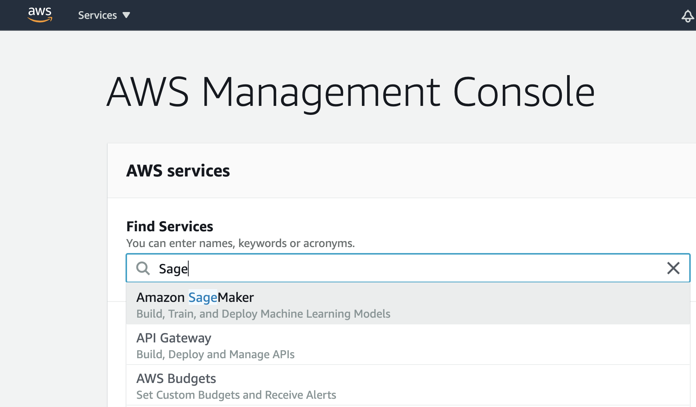
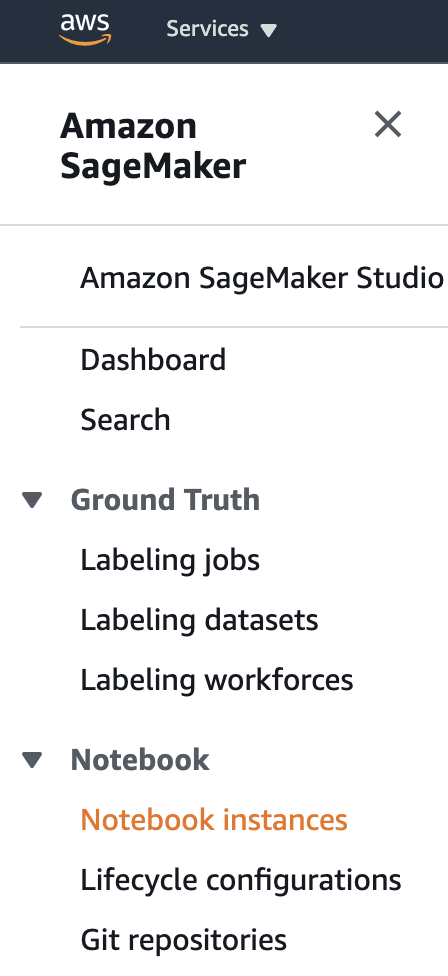
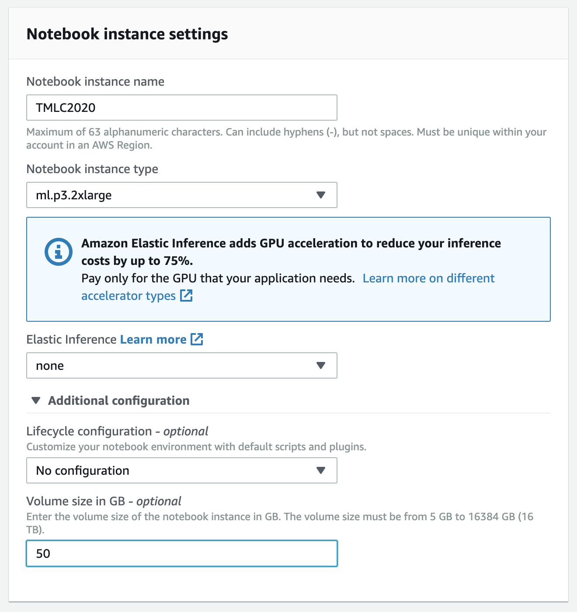
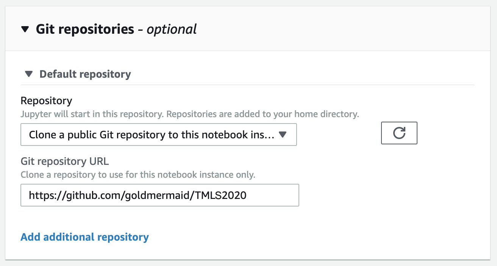
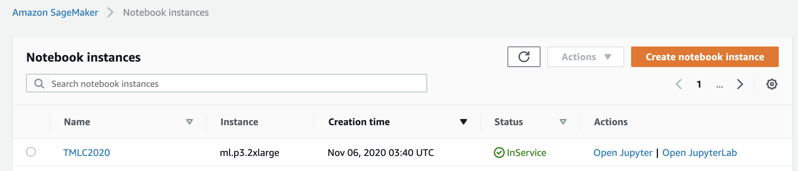

# ECML PKDD2020 Tutorial

## Title
Put Deep Learning to work: Accelerate Deep Learning through Amazon SageMaker and ML Services

## Abstract
Deploying deep learning (DL) projects are becoming increasingly more pervasive at enterprises and startups alike. At Amazon, Machine Learning University (MLU)-trained engineers are taking DL to every aspect of Amazon’s businesses, beyond just Amazon Go, Alexa, and Robotics.
In this tutorial, Tim O’Brien (AWS), Rachel Hu (AWS) and Wenming Ye (AWS) offer a practical next step in DL learning with instructions, and hands-on labs using the latest Nvidia GPUs and AWS Inferentia. You will explore the current trends powering AI/DL adoption, powerful new GPU/AWS Inferentia accelerator instances, distributed training and inference optimization in neural networks.

## Author Bios

**Tim O’Brien** brings over 30 years of experience in information technology, security, and accounting to his customers. Tim has worked as a Senior Solutions Architectat AWS since 2018 and is focused on Machine Learning and Artificial Intelligence.Previously, as a CTO and VP of Engineering, he led product design and technical delivery for three startups. As a Certified Public Accountant and later as a consultant at Deloitte Consulting, Tim served numerous businesses in the Pacific Northwest conducting security related activities, including data center reviews, lottery security reviews, and disaster planning.Tim earned his Masters of Software Engineering at Seattle University, and a B.A. in Accounting at the University of Washington. He also holds the AWS Machine Learning Specialty Certification.In his spare time, he likes hiking, climbing, and skiing with his wife and two dogs. 

**Rachel Hu** is an applied scientist on the AWS AI working on deep learning. She received her master’s degree of statistics from University of California, Berkeley. She is an instructor at Amazon Machine Learning University and frequently presents at external events such as AWS Re:invent, Nvidia GTC, etc. She enjoys empowering everyone who is curious about start-of-the-art deep learning algorithms with easy to understand instructions and innovative new teaching tools. Before joining Amazon, Rachel also worked on natural language processing projects to promote user engagements in multiple industries.

**Wenming Ye** is an AI and ML specialist architect at Amazon Web Services, helping researchers and enterprise customers use cloud-based machine learning services to rapidly scale their innovations. Previously, Wenming had a diverse R&D experience at Microsoft Research, SQL engineering team, and successful startups.

## Agenda

|   CETS Time    |  Title    |  Speaker | Slides/Notebooks    |
| ---- | ---- | ---- | ---- |
| 3:30 PM | **Welcome and Logistics** | Tim O’Brien; Rachel Hu; Wenming Ye | N/A |
| 3:40 PM | **Amazon AI and SageMaker Overview** | Wenming Ye | [slides](https://github.com/goldmermaid/ECMLPKDD2020/blob/master/ecmlpkdd2020.pdf) |
| 4:10 PM | **BERT and Transformer** | Rachel Hu  | (same as above)  |
| 4:50 PM | **Lab: Fine Tuning BERT Model on Q&A dataset** | Rachel Hu  |  [jupyter](https://github.com/goldmermaid/ECMLPKDD2020/blob/master/bert_finetune/bert_pytorch_finetuning.ipynb) |
|  | (10 min break during model training)  |
| 5:30 PM | **Lab: Model Deployment** | Rachel Hu  | (same as above) |
| 6:00 PM | **Conclusion** | Tim O’Brien; Rachel Hu; Wenming Ye | N/A  |

## Prerequisites
You will need a Laptop. We recommend that you have an extra Screen if available.

## Slides

Download [Here](./ecmlpkdd2020.pdf). 

## AWS Account
AWS account is not required for this Lab, you will be provided with a Hash URL to access a pre-provisioned AWS environment and Amazon Sagemaker.

Amazon SageMaker is a fully-managed service that enables developers and data scientists to quickly and easily build, train, and deploy machine learning models at any scale. Amazon EC2 P3 instances deliver the highest performance compute in the cloud, are cost-effective, support all major machine learning frameworks, and are available globally. In this workshop, you'll create a SageMaker notebook instance and work through sample Jupyter notebooks that demonstrate some of the many features of SageMaker and how Amazon EC2 P3 is used to accelerate machine learning model training.

## Live Lab Instructions:
1. Go to Events engine website (will be given during live event), on team dashboard, click on AWS Console. If you are using your own account, skip to step 3.
1. Now click on `Open AWS Console`. Find, and click on `Amazon SageMaker` service link on the main page.
    
1. On the left side menu, go down to Notebook, select submenu item `Notebook instances`. Now, click on the orange `Create notebook instance` Button.
    
1. Pick a notebook instance name in the first text box.
1. For notebook instance type, select "**ml.p2.xlarge**".
1. Click `Additional Configuration`, and set "Volume size in GB" to be "50 GB".
    

1. Scroll down and click `Git repositories`. Click the drop-down menue and select `Clone a Public Git....`. Then, enter: "**https://github.com/goldmermaid/ECMLPKDD2020**" in the text box.
    
1. Finally, click on the orange `Create notebook instance` Button. Now the notebook instance launching request is sent and the instance's status is show `Pending`. It should be launched in 2-5 minutes.

Once the instance's status turns Green `In Service`:
1. Click on `Open Jupyter`.
    
    
1. In the directory `bert_finetuning`, open Jupyter notebook "**bert_pytorch_finetuning.ipynb**".

Now go ahead and finetune your BERT model on SQuAD dataset!

(If you are interested in our Research reward program, please see the link below. Or contact us directly. https://aws.amazon.com/aws-ml-research-awards/)

## License
The contents of this workshop are licensed under the Apache 2.0 License.

